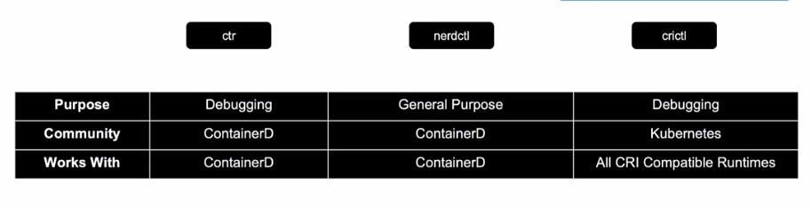

# Docker vs ContainerD

## Docker

- 컨테이너가 생기기 전에는 도커밖에 없었고 도커를 통해 컨테이너 작업을 했었다

## RKT

- 컨테이너의 관리 단위인 POD

## kubelet

- 클러스터의 각 노드에서 실행되는 에이전트.
- 컨테이너가 파드 스펙의 집합을 받아서 그에 따라 정상적으로 동작하도록 관리.
- 쿠버네티스를 통해 생성되지 않은 파드는 관리 X.

## CRI

- 컨테이너 런타임 인터페이스
- 클러스터의 모든 노드에 동작 중인 컨테이너 런타임이 존재해야, kubelet이 파드들과 컨테이너들을 구동할 수 있다.

- 컨테이너 런타임 인터페이스(CRI)는 kubelet과 컨테이너 런타임 사이의 통신을 위한 주요 프로토콜이다.
- 이미지 스펙(이미지를 만드는 방법)과 빌드 방식에 대한 기준인 OCI 표준을 준수하는 공급업체에 대해 쿠버네티스 컨테이너 런타임으로 작업할 수 있도록 해준다.

## 컨테이너 런타임

- 컨테이너를 구동시키는 소프트웨어
- 종류로는 
  - containerd
  - CRI-O
  - 도커 엔진
  - 미란티스 컨테이너 런타임

## Dockershim

- docker는 CRI 이전부터 있었기에 이를 준수하지 않는다. 따라서 쿠버네티스가 docker 컨테이너 실행을 지원하기 위해서 도입.
- 쿠버네티스 1.24v 이후부터 지원이 제거되었다.

## containerd

- 컨테이너 런타임
- 도커의 기능에 포함되었었지만 현재는 독립된 프로젝트로서 별도 설치가 가능하다.
- 도커 없이 containerd만 설치할 경우 이를 실행하기 위해
  - ctr(사용자 친화적x, 디버깅 용으로만 사용, 지원 기능 제한적)
  - nerdctl(대부분의 도커 옵션을 지원, 컨테이너 최신 기능 액세스 가능, 느린 이미지 풀링)
  - crictl(CRI 호환 가능한 컨테이너 런타임과 상호작용, 쿠버네티스 관점에서 상호작용, 별도 설치 필요, kubelet의 파드 제어 정책과 충돌날 경우 crictl로 실행된 컨테이너 설정이 무시되므로 디버깅 목적으로만 사용)
등의 cli tool들을 사용.
    

# ETCD

## ETCD란?

- key value 저장 시스템
- SQL과 같은 데이터베이스는 각각의 row에 대한 새로운 column 정보가 영향을 미치지만 ETCD는 각각의 데이터 객체에 대한 정보만을 독립적으로 다룬다.

## ETCD 설치

```bash
$ git clone -b v3.5.0 https://github.com/etcd-io/etcd.git
$ cd etcd
$ ./build.sh
$ export PATH="$PATH:`pwd`/bin" # etcd 명령어 활성화를 위한 path 설정
$ etcd --version # Test
$ etcdtl --version # 어떤 API 버전을 사용하는지 확인
$ ETCDCTL_API=3 # API 버전 변경 가능
```

## ETCD in k8s

- nodes, pods, configs, secrets, accounts, roles, bindings ... 등의 k8s 클러스터 내부의 설정값들이 업데이트 됨.

- k8s내부의 데이터 저장 구조

  ```pre
  Registry─minions
        └──pods
        └──replicasets
        └──deployments
        └──roles
        └──secrets
  ```
- HA(고가용성) 환경에서는 다수의 마스터 노드들이 클러스터 내에 존재하며 여러 etcd 서비스 간에 서로를 인식할 수 있도록 설정

# Kube api server

- kubectl이 아니라 curl 명령을 통해 etcd cluster로부터 유저 인증
- node에 pod를 바로 생성하는 것이 아닌 etcd 설정 업데이트
- 클러스터 bootstrapping(자동운영, 부팅)에 kubeadmin을 이용하면 상관없으나, hardware 설정을 할 경우 이용할 수 있음
- kubeadmin으로 설정할 경우 API server는 master node의 namespace 안의 pod로 배포된다
- non kubeadmin으로 설정할 경우 etc/systemd/system/kube-apiserver.service. 프로세스로서 동작한다

## 동작 순서(파드 생성 예시)

1. API server가 node 없이 pod object 생성. 유저에게 알림
2. etcd server에 인프라 정보 업데이트
3. scheduler는 node가 없는 pod를 발견하고 적절한 node를 선택하여 API server에 알림
4. API server가 다시 etcd 정보를 업데이트하고 해당 node의 kubelet에게 pod 정보를 전달
5. kubelet이 해당 node에 pod를 생성 후 container runtime engine에게 이미지를 배포하도록 지시
6. 마지막으로 kubelet이 API server에게 pod 생성 내용을 전달하고 API server가 이를 etcd에 반영