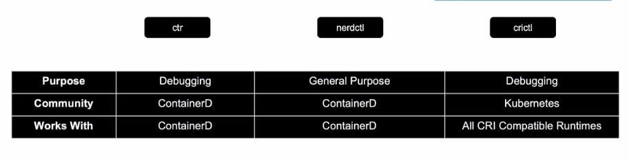
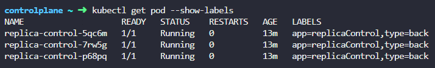
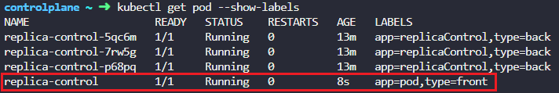
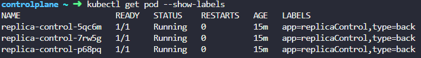
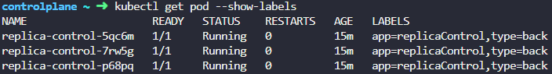
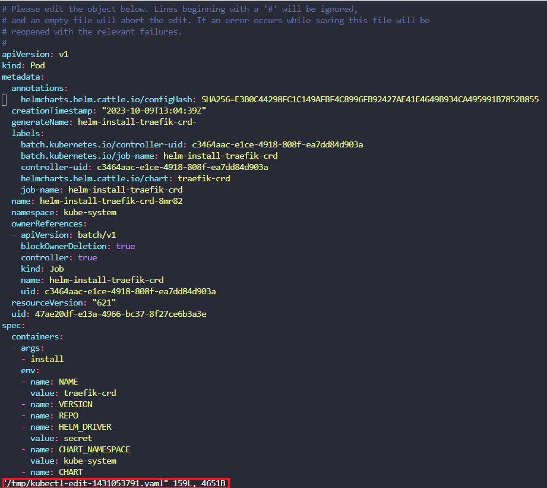
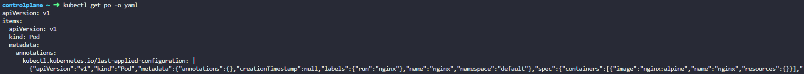
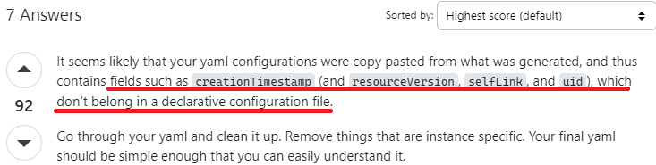

# Docker vs ContainerD

## Docker

- 컨테이너가 생기기 전에는 도커밖에 없었고 도커를 통해 컨테이너 작업을 했었다

## RKT

- 컨테이너의 관리 단위인 POD

## kubelet

- 클러스터의 각 노드에서 실행되는 에이전트.
- 컨테이너가 파드 스펙의 집합을 받아서 그에 따라 정상적으로 동작하도록 관리.
- 쿠버네티스를 통해 생성되지 않은 파드는 관리 X.

## CRI

- 컨테이너 런타임 인터페이스
- 클러스터의 모든 노드에 동작 중인 컨테이너 런타임이 존재해야, kubelet이 파드들과 컨테이너들을 구동할 수 있다.

- 컨테이너 런타임 인터페이스(CRI)는 kubelet과 컨테이너 런타임 사이의 통신을 위한 주요 프로토콜이다.
- 이미지 스펙(이미지를 만드는 방법)과 빌드 방식에 대한 기준인 OCI 표준을 준수하는 공급업체에 대해 쿠버네티스 컨테이너 런타임으로 작업할 수 있도록 해준다.

## 컨테이너 런타임

- 컨테이너를 구동시키는 소프트웨어
- 종류로는 
  - containerd
  - CRI-O
  - 도커 엔진
  - 미란티스 컨테이너 런타임

## Dockershim

- docker는 CRI 이전부터 있었기에 이를 준수하지 않는다. 따라서 쿠버네티스가 docker 컨테이너 실행을 지원하기 위해서 도입.
- 쿠버네티스 1.24v 이후부터 지원이 제거되었다.

## containerd

- 컨테이너 런타임
- 도커의 기능에 포함되었었지만 현재는 독립된 프로젝트로서 별도 설치가 가능하다.
- 도커 없이 containerd만 설치할 경우 이를 실행하기 위해
  - ctr(사용자 친화적x, 디버깅 용으로만 사용, 지원 기능 제한적)
  - nerdctl(대부분의 도커 옵션을 지원, 컨테이너 최신 기능 액세스 가능, 느린 이미지 풀링)
  - crictl(CRI 호환 가능한 컨테이너 런타임과 상호작용, 쿠버네티스 관점에서 상호작용, 별도 설치 필요, kubelet의 파드 제어 정책과 충돌날 경우 crictl로 실행된 컨테이너 설정이 무시되므로 디버깅 목적으로만 사용)
등의 cli tool들을 사용.
    

# ETCD

## ETCD란?

- key value 저장 시스템
- SQL과 같은 데이터베이스는 각각의 row에 대한 새로운 column 정보가 영향을 미치지만 ETCD는 각각의 데이터 객체에 대한 정보만을 독립적으로 다룬다.

## ETCD 설치

```bash
$ git clone -b v3.5.0 https://github.com/etcd-io/etcd.git
$ cd etcd
$ ./build.sh
$ export PATH="$PATH:`pwd`/bin" # etcd 명령어 활성화를 위한 path 설정
$ etcd --version # Test
$ etcdtl --version # 어떤 API 버전을 사용하는지 확인
$ ETCDCTL_API=3 # API 버전 변경 가능
```

## ETCD in k8s

- nodes, pods, configs, secrets, accounts, roles, bindings ... 등의 k8s 클러스터 내부의 설정값들이 업데이트 됨.

- k8s내부의 데이터 저장 구조

  ```pre
  Registry─minions
        └──pods
        └──replicasets
        └──deployments
        └──roles
        └──secrets
  ```
- HA(고가용성) 환경에서는 다수의 마스터 노드들이 클러스터 내에 존재하며 여러 etcd 서비스 간에 서로를 인식할 수 있도록 설정

# Kube api server

- kubectl이 아니라 curl 명령을 통해 etcd cluster로부터 유저 인증
- node에 pod를 바로 생성하는 것이 아닌 etcd 설정 업데이트
- 클러스터 bootstrapping(자동운영, 부팅)에 kubeadmin을 이용하면 상관없으나, hardware 설정을 할 경우 이용할 수 있음
- kubeadmin으로 설정할 경우 API server는 master node의 namespace 안의 pod로 배포된다
- non kubeadmin으로 설정할 경우 etc/systemd/system/kube-apiserver.service. 프로세스로서 동작한다

## 동작 순서(파드 생성 예시)

1. API server가 node 없이 pod object 생성. 유저에게 알림
2. etcd server에 인프라 정보 업데이트
3. scheduler는 node가 없는 pod를 발견하고 적절한 node를 선택하여 API server에 알림
4. API server가 다시 etcd 정보를 업데이트하고 해당 node의 kubelet에게 pod 정보를 전달
5. kubelet이 해당 node에 pod를 생성 후 container runtime engine에게 이미지를 배포하도록 지시
6. 마지막으로 kubelet이 API server에게 pod 생성 내용을 전달하고 API server가 이를 etcd에 반영

## kubernetes pod

### pod란

- linux 컨테이너를 하나 이상 모아 놓은 것
- 쿠버네티스 애플리케이션의 최소 단위
- 보통은 단일 컨테이너로 이루어져 있지만 여러 컨테이너로 이루어진 경우도 있다
- 같은 pod의 컨테이너끼리는 동일한 컴퓨팅 리소스를 공유한다
- 

### kubectl pod 명령어 기본

- kubectl get pod # -o wide 덧붙일 경우 node 및 추가 정보 확인
- kubectl describe [pod_name] # pod에 대한 상태, 로그, 사용된 이미지, 컨테이너 정보 확인
- kubectl delete pod [pod_name] # pod 삭제
- kubectl run [pod_name] --image=[image_name] --dry-run -o yaml > file_name.yaml # pod 기동을 yaml 파일 형식으로 작성하여 준다. kubectl run [pod_name] --image=[image_name] 까지만 입력할 경우 실제 image pull 후 pod 기동 실행
- kubectl create -f file_name.yaml # yaml 파일을 통한 pod 기동
- kubectl apply -f file_name.yaml # 변경된 파일 내용을 기동된 pod에 적용

## ReplicationController & Replicaset

### 사용 이유

- 기존 pod가 기동 실패할 경우 자동으로 새로운 pod를 가져온다
- 다수의 pod에 부하를 분산시킬 수 있다

### 차이점

=> Replicaset은 ReplicationController와 다르게 
  
  ```yaml
  ...
    selector:
      matchLabels:
        app: webui
  ```
를 추가하여 kind 이름이 아닌 라벨을 단위로 pod를 관리한다.

  1. replica와 label이 다른 pod 기동 시

  
  

  2. replica와 label이 동일한 pod 기동 시

  
  

ReplicationController의 경우 metadata: name: 에 입력되는 ReplicationController 이름기준으로 관리됨

### 추가 팁

- kubectl 사용 시 pod => po, replicaset => rs 로 사용하여 시간을 단축하고 오타를 감소
- kubectl create -f [yamlfile] 에서 create 명령은 최초 pod 생성 시 사용하며
apply, replace 명령은 yamlfile에 변경점이 있을 때 기존에 생성된 리소스를 업데이트 하는 용도로 주로 사용되는 것으로 보임

https://may9noy.tistory.com/302

위 내용에 따르면 `create은 yaml 파일안에 모든 것을 기술해야 하는 반면 apply 명령어는 부분적인 spec만 주어져도 업데이트가 잘 진행 된다는 뜻` 이라고 나와있다

또한 replace 명령은 apply와 달리 기존에 생성된 리소스가 없는 경우에는 에러가 난다고 한다

- **kubectl 컨셉 명령형 vs 선언형**

  https://dodo-devops.tistory.com/53

### kubectl edit 파일

- edit 명령어 실행 시

  
  
  명령 수행 시 파일을 /tmp/ 디렉터리 밑에 생성하고 명령 실행 후 즉시 삭제하여 주는 듯하다

## replicaset vs deployment

- desired pod 수를 보장한다 (replicaset의 경우 imagepull이 실패했을 때 올바른 이미지 이름으로 변경하여 오류를 해결해도 수동으로 pod를 지워줘야만 정상 pod가 기동되었다)
- failed pod를 대체하고 pod의 수를 scaling 한다
- rolling update는 deployment에서만 제공된다
- rollback 기능은 deployment에서만 제공된다

**chat gpt에게 질문**
#### deployment대신 replicaset을 사용해야 하는 이유?

1. 단순한 복제 관리: 애플리케이션을 단순히 특정 수의 Pod 인스턴스로 복제하고 관리해야 하는 경우 ReplicaSet은 이를 수행하는 데 적합합니다. Deployment는 배포 및 롤백과 같은 고급 배포 전략을 제공하지만, 이러한 기능이 필요하지 않은 경우 ReplicaSet만 사용하여 Pod를 관리할 수 있습니다.

2. 더 낮은 추상화 수준: Deployment는 ReplicaSet 위에 구축되었으며, 더 높은 추상화 수준을 제공합니다. 그러므로 Deployment보다 ReplicaSet은 Pod의 생성 및 관리에 더 직접적인 제어를 제공합니다.

3. 다른 상위 컨트롤러와의 통합: ReplicaSet은 StatefulSet, DaemonSet 등과 같은 다른 상위 컨트롤러와 통합되어 사용될 수 있습니다. 특정 애플리케이션 유형에 필요한 복제 및 관리 기능을 제공하는 상위 컨트롤러와 함께 ReplicaSet을 사용할 수 있습니다.

4. 미세한 제어와 사용자 정의: ReplicaSet을 사용하면 Pod의 복제본을 정확하게 제어하고 사용자 정의 설정을 쉽게 구현할 수 있습니다. 예를 들어, 특정 환경 변수, 리소스 제한, 레이블 등을 Pod 템플릿에 직접 정의할 수 있습니다.

=> 좀 더 직접적이고 미세한 제어가 필요한 경우, 또는 결합도를 낮춰 상위 컨트롤러와의 커플링된 설정을 통해 구체적인 배포 전략을 설정하기 위함으로 보인다

- deployment.yaml 예시
    ```yaml
    apiVersion: apps/v1
    kind: Deployment
    metadata:
        name: deployment-pod
        labels:
            app: app
            type: front
    spec:
        template:
            metadata:
                name: nginx-pod
                labels:
                    app: app
            spec:
                containers:
                  - name: nginx-container
                    image: nginx
        selector:
            matcheLabels:
                app: app
        replicase: 3
    ```
## Service

- 외부 -> pod, pod -> 외부 연결을 위해 사용
- service.yaml 예시
    
    ```yaml
    apiVersion: v1
    kind: Service
    metadata:
        name: myapp-service
    spec:
        type: NodePort # default는 ClusterIP
        ports:
          - targetPort: 80 # pod의 포트이며 지정하지 않을 경우 port를 따라감
            port: 80 # 필수값
            nodePort: 30008 # 30000 ~ 32767
        selector:
            app: myapp # matchLabels key는 없으나 라벨값을 통해 pod 특정
            type: front-end
    ```
    => service는 metadata의 name이나 label을 통해 pod를 특정한다. deployment의 template과는 다름!!

  **궁금했던 점**
    ```bash
    kubectl run custom-nginx --image=nginx --port=8080
    ```
    위와 같이 서비스를 이용하지 않고 pod에 포트를 직접 노출시키는 경우에는 단일 pod만을 외부에 노출하고자 할 때 사용할 수 있다고 함. 물론 ClusterIP와 마찬가지로 cluster 내부에서는 접근 가능.

## Namespace

- kubernetes는 기본적으로 default namespace를 사용
- namespace가 다르면 같은 pod 이름이라도 별개의 object가 생성
- namespace 마다 리소스 제한량(quota)를 설정할 수 있음
  ```yaml
  apiVersion: v1
  kind: List
  items:
  - apiVersion: v1
    kind: ResourceQuota
    metadata:
      name: pods-high
      namespace: dev
    spec:
      hard:
        cpu: "1000"
        memory: 200Gi
        pods: "10"
      scopeSelector:
        matchExpressions:
        - operator : In
          scopeName: PriorityClass
          values: ["high"]
  ```
- namespace commands

  ```bash
  kubectl get pods --namespace=dev # dev namespace의 pod 조회
  kubectl config set-context $(kubectl config current-context) --namespace=dev # dev namespace를 기본 namespace로 설정
  kubectl config view --minify # namespace 확인
  kubectl get pods --all-namespaces # 모든 namespace에 대한 pod 전부 조회
  ```

  => 만약 다른 namespace에서 dev namespace의 `db-service`라는 이름의 svc에 접근할 경우
    ```yaml
    db-service.dev.svc.cluster.local # [svc_name].[namespace_name].[svc].cluster.local
    ```
  ## kubectl local, last applied configuration, live object configuration (kubectl apply)

  - local file은 사용자가 직접 작성하는 yaml file
  - live object configuration은 k8s memory에 저장됨
  - live object의 metadata.annotations 내부에 기록됨

    ```bash
    kubectl get <객체종류> <객체명> -o yaml
    ```
    위 명령 형식으로 확인 가능하다

    

    아래의 절차에 익숙해지면 좋을듯 하다.

    - pod 변경 예시

      ```bash
      
      kubectl run nginx --image=nginx --dry-run=client -o yaml > nginx_pod.yaml
      # nginx_pod.yaml 내에서 image 변경
      kubectl apply -f 
      ```

      => --dry-run=client 옵션을 주지 않고 바로 생성하면 live object configuration 값들로 파일이 생성되어 일반적인 생성을 위한 declarative configuration 파일에는 포함되지 않는 값들이 추가되기 때문에 apply 명령을 실행할 경우 에러가 난다. 

      

      https://stackoverflow.com/questions/51297136/kubectl-error-the-object-has-been-modified-please-apply-your-changes-to-the-la

      
      
      또한 apply가 아닌 create 명령은 imperative 명령으로 설정되어 있기 때문에 last applied configuration이 업데이트 되지 않는다. 만약 create으로 last applied configuration를 업데이트 하고 싶다면 --save-config 옵션을 줘야 하므로 apply를 습관화 하는것이 좋아 보인다.

      
