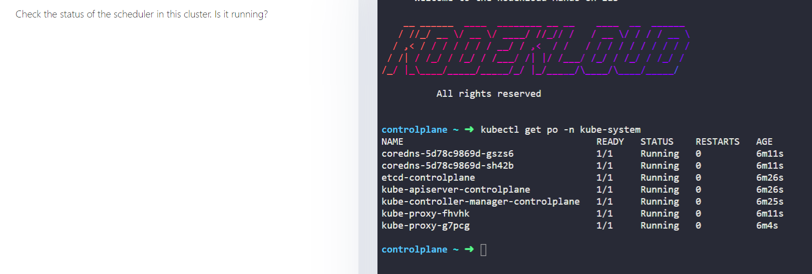

## k8s kube-system namespace 조사해보기

- k8s의 동작과 관련된 pod들이 존재하는 namespace
- KodeKloud 강의에서는 스케줄러가 실행되는지를 kube-system namespace에서 확인했지만 이는 pod 이름으로 확인한 것이며 이전 Core Concepts 파트에서 제공된 lab 환경에는 `scheduler` 라는 단어로 명명된 pod가 없었음에도 pod가 정상적으로 잘 기동되었다.
- stackoverflow에 따르면 아래 명령어로 스케줄러의 상태를 확인 가능하다고 한다.

    ```bash
    kubectl get pods -n kube-system -l component=kube-scheduler
    ```



결론 : 

위 명령을 KodeKloud의 Core Concepts 파트의 labs 환경에서 실행해 보았지만 no resource라는 결과만 얻을 뿐이었다. 

스케줄러가 제대로 기동되고 있는지는 강의내용에선 kube-system 네임스페이스 안에 pod 이름이 `scheduler` 인 것이 있는지를 통해 확인했지만 Core Concepts lab 환경에서는 `scheduler` 라는 단어가 포함된 pod