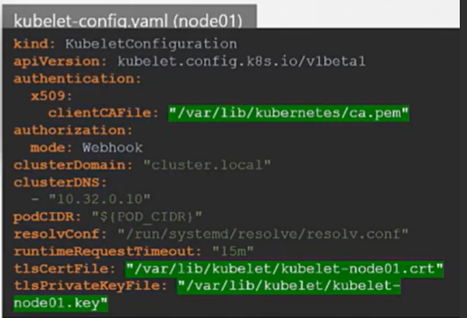
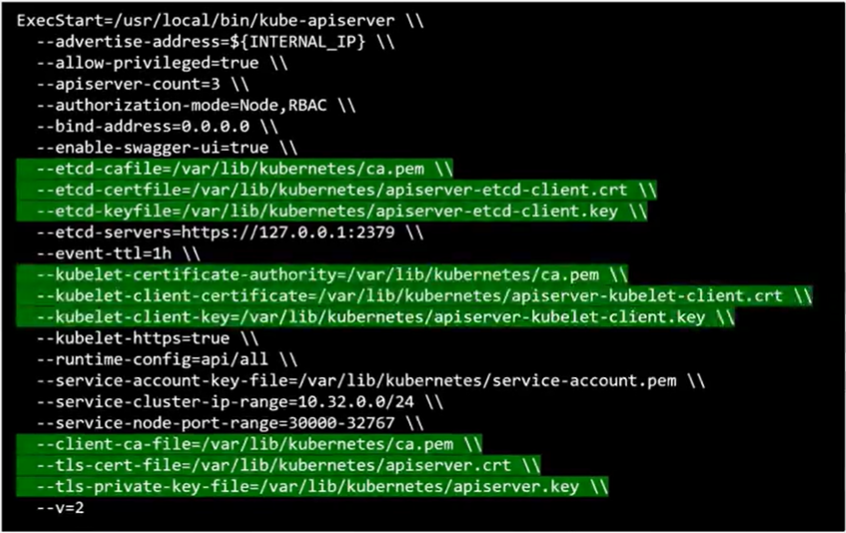
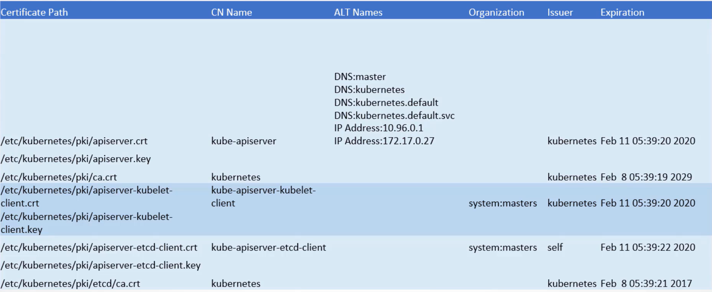

## TLS

개인, 공개 키 쌍으로 데이터를 암호화하여 전송하는 방식이다.
  
### 연결 순서

- 데이터 수신자가 송신자에게 최초 연결 시 비대칭 키 방식으로 자신의 public key를 전송한다.
- 데이터 송신자가 데이터와 함께 수신자로부터 받은 public key로 암호화 된 데이터를 수신자 측에 보낸다.
- 수신자는 데이터를 자신의 private key로 복호화하여 데이터를 읽는다.

**비대칭 키 방식**
=> 암호화와 복호화에 다른 키가 사용되는 방식. 위의 방식에서는 암호화에 public key, 복호화에 private key를 사용하였기에 비대칭 키 방식이라고 할 수 있다.

## kube-apiserver에 인증설정

### 계정, 토큰 사용

```csv
# /home/user/auth.csv
passwor123, user1, u0001
passwor123, user2, u0002
passwor123, user3, u0003
passwor123, user4, u0004
passwor123, user5, u0005
```

```yaml
# /etc/kubernetes/manifests/kube-apiserver.yaml
apiVersion: v1
kind: Pod
metadata:
  annotations:
    kubeadm.kubernetes.io/kube-apiserver.advertise-address.endpoint: 172.21.1.51:6443
  creationTimestamp: null
  labels:
    component: kube-apiserver
    tier: control-plane
  name: kube-apiserver
  namespace: kube-system
spec:
  containers:
  - command:
    - kube-apiserver
    - --advertise-address=172.21.1.51
    - --allow-privileged=true
    - --anonymous-auth=True
    - --apiserver-count=1
    - --authorization-mode=Node,RBAC
    - --basic-auth-file=/home/user/auth.csv # 이 부분에 인증파일의 위치를 지정
```

kube-apiserver를 restart 해주어야 위의 설정이 적용된다.
적용 후에 다음과 같이 사용 가능하다.

```bash
curl -v -k https://master-node-ip:6443/api/v1/pods -u "user1:password123"
```

4번째 컬럼으로 group을 넣을 수도 있다.

```csv
passwor123, user1, u0001, group1
passwor123, user2, u0002, group1
passwor123, user3, u0003, group2
passwor123, user4, u0004, group2
passwor123, user5, u0005, group2
```

Bearer token 사용 시 아래와 같이 사용한다.

```csv
# /home/user/user-token-details.csv
KpjCVbI7rCFAHTYPKByTIzRb7gu1cUc4VB, user10, u0010, group1
```

```
위의 yaml에서 spec.containers[n].command 위치에

--token-auth-file=/home/user/user-token-details.csv
```

### 키 사용

키페어 방식에서 인증서(crt)는 id에, 키는 pw에 해당한다고 생각하면 된다.

```bash
openssl genrsa -out apiserver.key 2048
```
=> apiserver.key 생성

```bash
openssl req -new -key apiserver.key -subj "/CN=kube-apiserver" -out apiserver.csr -config openssl.cnf
```
=> apiserver.csr 생성

```cnf
# openssl.cnf
[req]
req_extensions = v3_req
distinguished_name = req_distinguished_name
[ v3_req ]
basicConstraints = CA:FALSE
keyUsage = nonRepudiation,
subjectAltName = @alt_names
[alt_names]
DNS.1 = kubernetes
DNS.2 = kubernetes.default
DNS.3 = kubernetes.default.svc
DNS.4 = kubernetes.default.svc.cluster.local
IP.1 = 10.96.0.1
IP.2 = 172.17.0.87
```

```bash
openssl x509 -qeq -in apiserver.csr -CA ca.crt -CAkey ca.key -out apiserver.crt
```
=> apiserver. crt 생성

위의 과정을 각각의 노드에서 진행한 후 각 노드의 kubelet-config.yaml을 다음과 같이 수정한다.



kube-apiserver를 restart 후 kube-apiserver ExecStart 확인해보면 아래와 같이 변경된다.



- kubeadm 인증서 파일 정보

